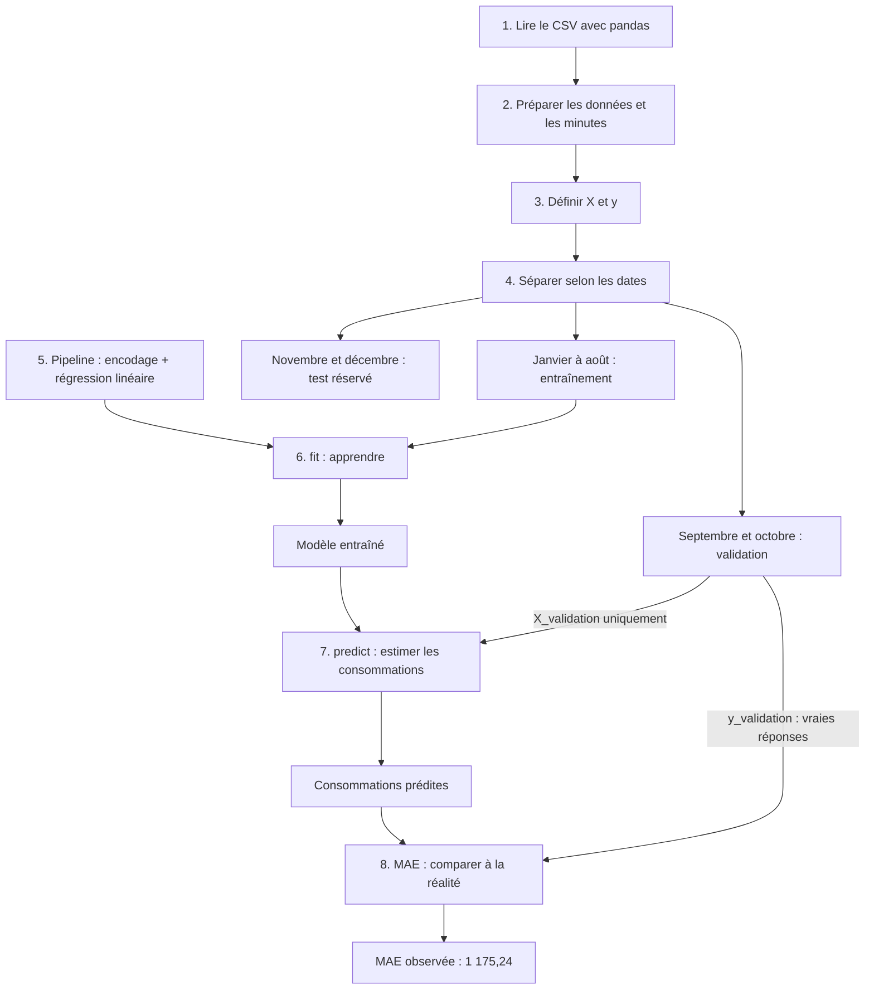

# EnergIA — Prédiction de la consommation électrique par région

Projet pédagogique pour apprendre le machine learning avec Python et scikit-learn, étape par étape.

L’objectif est d’estimer la consommation électrique pour une région et un créneau de 30 minutes. La version actuelle utilise une **régression linéaire commune aux 12 régions du dataset**, entraînée sur une partie de 2025 et évaluée sur une période plus récente.

## État actuel

- Lecture et préparation du CSV réalisées.
- Séparation chronologique entre entraînement, validation et test réalisée.
- Encodage des régions et entraînement d’une régression linéaire réalisés.
- Prédictions sur septembre et octobre 2025 réalisées.
- Erreur absolue moyenne de validation observée : **1 175,24**.
- Test final de novembre et décembre conservé pour la suite, sans évaluation à ce stade.

Le projet réalise actuellement une évaluation historique : les consommations réelles existent déjà et permettent de vérifier les prédictions. La génération de données pour une période future et la sauvegarde du modèle ne sont pas encore implémentées.

## Organisation du projet

```text
EnergIA_final/
├── ConsomationML.py                 # Préparation, apprentissage et validation
├── index.py                        # Fichier présent, actuellement vide
├── etl/
│   ├── ectraction.py                # Téléchargement des données sources
│   └── dataframe.py                 # Fusion et création du CSV
└── data/
    ├── dataset_final.csv           # Données utilisées par le modèle
    ├── eco2mix-regional.json
    ├── meteo-regions.json
    ├── calendrier-2025.json
    └── vacances-scolaires-regions.json
```

Le nom `ectraction.py` correspond au nom actuel du fichier.

## Données utilisées

Le dataset examiné contient **210 240 lignes pour l’année 2025**, soit **17 520 observations par région**, à un pas de 30 minutes.

Les 12 régions présentes sont : Auvergne-Rhône-Alpes, Bourgogne-Franche-Comté, Bretagne, Centre-Val de Loire, Grand Est, Hauts-de-France, Île-de-France, Normandie, Nouvelle-Aquitaine, Occitanie, Pays de la Loire et Provence-Alpes-Côte d’Azur.

**Le périmètre ne couvre pas toute la France : la Corse et les régions d’outre-mer sont absentes.**

Les scripts d’extraction utilisent les données électriques éCO2mix régionales, la météo historique Open-Meteo et des calendriers de jours fériés et de vacances scolaires. La météo est associée à une ville de référence par région.

Le CSV contient davantage de colonnes que celles utilisées par le modèle. Dans la version actuelle, la météo et les mesures de production électrique ne font pas partie des variables d’entrée.

## Bibliothèques et rôles

| Outil | Utilisation |
|---|---|
| `pathlib.Path` | Construire les chemins des fichiers ; fourni avec Python |
| `pandas` | Lire le CSV, préparer les colonnes et sélectionner les périodes |
| `OneHotEncoder` | Transformer les noms de régions en indicateurs numériques |
| `ColumnTransformer` | Encoder la région et conserver les autres colonnes |
| `Pipeline` | Enchaîner la préparation et la régression |
| `LinearRegression` | Apprendre une formule d’estimation de la consommation |
| `mean_absolute_error` | Mesurer l’écart moyen entre prédictions et réalité |
| `requests` | Télécharger les données dans le script d’extraction |

`scikit-learn` est le nom de la bibliothèque à installer ; `sklearn` est le nom utilisé dans les imports Python.

## Exécuter le modèle

Depuis un terminal ouvert à la racine du projet, avec l’environnement Python du projet activé :

```powershell
python -m pip install pandas scikit-learn
python ConsomationML.py
```

Le fichier `data/dataset_final.csv` doit déjà être présent. Le script calcule son chemin à partir de l’emplacement de `ConsomationML.py`.

Chaque exécution entraîne à nouveau le modèle puis affiche les premières prédictions et la MAE. Le modèle n’est pas enregistré sur disque.

Pour travailler sur l’extraction des sources, `requests` est également nécessaire. Les scripts ETL téléchargent ou réécrivent des fichiers de données ; leur exécution n’est pas nécessaire pour entraîner le modèle si le CSV est déjà disponible. Leur relancement n’a pas été vérifié dans cette étape du projet.

## Les étapes du modèle

### 1. Lire le CSV

```python
df = pd.read_csv(
    chemin_csv,
    sep=None,
    engine="python",
    encoding="utf-8-sig",
)
```

`df` est un DataFrame : un tableau dans lequel chaque ligne correspond à une observation et chaque colonne à une information.

### 2. Préparer les données

```python
df = preparer_donnees(df)
df["minute"] = df["heure"].str.split(":").str[1].astype(int)
```

La fonction `preparer_donnees` :

- retire les espaces autour des noms de colonnes ;
- convertit `date_locale` en date et signale les dates invalides ;
- convertit les indicateurs de jours fériés et de vacances en 0 ou 1 ;
- extrait l’année, le mois et le jour de la semaine ;
- crée les indicateurs de week-end et de saisons ;
- convertit les mesures numériques, en acceptant les virgules décimales.

La colonne `minute` permet de distinguer, par exemple, 18 h et 18 h 30. Toutes les colonnes préparées ne sont pas nécessairement utilisées par le modèle.

Cette étape prépare les exemples ; elle n’entraîne pas le modèle. Les conversions numériques utilisent `errors="coerce"` : une valeur non convertible devient manquante. Une vérification des valeurs manquantes reste donc nécessaire si le CSV change.

### 3. Définir les informations X et la réponse y

```python
colonnes = [
    "libelle_region",
    "mois",
    "jour_semaine",
    "heure_locale",
    "minute",
    "ferie",
    "vacances_scolaires",
]

X = df[colonnes].copy()
y = df["consommation"].copy()
```

- **X** contient les sept informations que le modèle reçoit.
- **y** contient la consommation réelle qu’il doit apprendre à estimer.

L’objectif est une **régression supervisée** : prédire un nombre à partir d’exemples pour lesquels la réponse est connue. La consommation n’est pas dans X, puisqu’elle représente la valeur recherchée.

### 4. Séparer les périodes

```python
masque_train = df["date_locale"] < "2025-09-01"
masque_validation = (
    (df["date_locale"] >= "2025-09-01")
    & (df["date_locale"] < "2025-11-01")
)
masque_test = df["date_locale"] >= "2025-11-01"
```

Ces filtres correspondent aux périodes suivantes pour le CSV 2025 actuel :

| Partie | Période | Nombre de lignes | Rôle |
|---|---|---:|---|
| Entraînement | 1er janvier au 31 août | 139 968 | Apprendre |
| Validation | 1er septembre au 31 octobre | 35 136 | Comparer et améliorer les modèles |
| Test | 1er novembre au 31 décembre | 35 136 | Évaluer le choix final |

Les filtres d’entraînement et de test ne contiennent respectivement pas de borne inférieure et de borne supérieure. Il faudra revoir les périodes si le fichier contient d’autres années.

```python
X_train = X.loc[masque_train].copy()
y_train = y.loc[masque_train].copy()

X_validation = X.loc[masque_validation].copy()
y_validation = y.loc[masque_validation].copy()

X_test = X.loc[masque_test].copy()
y_test = y.loc[masque_test].copy()
```

Le même masque est appliqué à X et y pour garder chaque observation avec sa bonne réponse. Toutes les régions d’une même date restent dans la même partie.

Le découpage chronologique reproduit l’objectif réel : apprendre sur le passé et évaluer sur une période plus récente. Évaluer uniquement sur les exemples d’entraînement ne permettrait pas de vérifier cette capacité.

### 5. Construire la préparation et le modèle

```python
preparation = ColumnTransformer(
    transformers=[
        (
            "region",
            OneHotEncoder(handle_unknown="ignore"),
            ["libelle_region"],
        )
    ],
    remainder="passthrough",
)

modele = Pipeline(
    steps=[
        ("preparation", preparation),
        ("regression", LinearRegression()),
    ]
)
```

La régression travaille avec des nombres. `OneHotEncoder` représente chaque région par des indicateurs, par exemple « Bretagne = 1 » et « Normandie = 0 » pour une observation bretonne.

`remainder="passthrough"` conserve les six autres variables numériques. `handle_unknown="ignore"` évite une erreur lors de l’encodage d’une région inconnue, mais ne garantit pas une bonne prédiction pour cette région.

La Pipeline réunit préparation et régression. À sa création, le modèle n’a encore rien appris.

### 6. Entraîner avec fit

```python
modele.fit(X_train, y_train)
```

La préparation apprend les catégories présentes dans les données d’entraînement, puis la régression ajuste ses coefficients avec X_train et y_train.

Une représentation simplifiée de la formule est :

```text
consommation estimée = constante
                    + effets de la région
                    + coefficient × mois
                    + coefficient × heure
                    + autres effets du calendrier
```

Seules les observations de janvier à août participent à cet apprentissage.

### 7. Prédire avec predict

```python
predictions = modele.predict(X_validation)
```

La Pipeline transforme les informations de septembre et octobre avec la préparation déjà apprise, puis calcule une estimation pour chaque ligne.

`predict` ne réentraîne pas le modèle. Les vraies consommations `y_validation` ne lui sont pas fournies.

Le modèle ne génère pas automatiquement les dates futures : la période prédite dépend des lignes présentes dans X_validation.

### 8. Afficher et évaluer les résultats

```python
comparaison = X_validation[["libelle_region"]].copy()
comparaison["consommation_reelle"] = y_validation
comparaison["consommation_predite"] = predictions

print(comparaison.head(10).round(1))

mae = mean_absolute_error(y_validation, predictions)
print("\nErreur absolue moyenne :", round(mae, 2))
```

`head(10)` affiche seulement dix exemples. La MAE utilise toutes les lignes de validation.

La **MAE**, ou erreur absolue moyenne, correspond à :

```text
MAE = moyenne des valeurs absolues de (réalité − prédiction)
```

Elle utilise la même unité que la cible ; ce n’est pas un pourcentage. `round(mae, 2)` arrondit l’affichage à deux décimales. Changer 2 en 4 ne change ni les dates ni les prédictions.

## Résultat observé à cette étape

Lors de l’exécution rapportée pendant le développement :

```text
Erreur absolue moyenne : 1175.24
```

Exemples affichés, avec les prédictions arrondies à une décimale :

| Région | Consommation réelle | Consommation prédite |
|---|---:|---:|
| Île-de-France | 5 462 | 5 858,5 |
| Centre-Val de Loire | 1 703 | 483,5 |
| Bretagne | 2 003 | 935,2 |
| Occitanie | 3 392 | 2 674,9 |

Ce résultat décrit la validation de septembre et octobre, pas le test final. Sans comparaison avec une référence simple et sans analyse par région, il ne permet pas à lui seul de conclure que le modèle est satisfaisant.

## Schéma des étapes



## Limites et suite prévue

- La première version utilise uniquement la région et le calendrier.
- Le mois, l’heure et le jour de la semaine sont traités comme des valeurs numériques linéaires. Leurs cycles et leurs interactions ne sont pas explicitement représentés.
- Le modèle actuel partage les coefficients de calendrier entre les régions et ajoute un effet propre à chaque région.
- Une seule année ne permet pas d’évaluer la stabilité des résultats sur plusieurs années ni toutes les saisons futures.
- Les valeurs manquantes ne font pas l’objet d’un remplacement automatique dans la Pipeline.
- Aucune référence simple, comparaison Random Forest, analyse d’erreur par région ou évaluation finale n’a encore été réalisée.

Les prochaines étapes envisagées sont de comparer à une prévision simple, examiner les erreurs par région, puis essayer Random Forest sur la même validation. La météo pourra ensuite être testée en tenant compte des prévisions réellement disponibles au moment de prévoir. Le test final restera réservé jusqu’au choix du modèle.

Une fois ce choix évalué, un réentraînement sur toute l’année pourra servir à préparer une prévision après 2025. Il faudra alors fournir les informations des nouveaux créneaux et disposer de nouvelles observations pour une évaluation indépendante.

## Vocabulaire à retenir

| Terme | Signification |
|---|---|
| Observation | Une ligne : une région à un instant donné |
| Variable d’entrée | Une information fournie au modèle, dans X |
| Cible | Le nombre à prédire, dans y |
| Entraînement | Apprentissage à partir des exemples et de leurs réponses |
| Validation | Données utilisées pour comparer les modèles et leurs réglages |
| Test | Données réservées à l’évaluation finale |
| `fit` | Apprendre |
| `predict` | Produire des estimations avec le modèle appris |
| MAE | Moyenne des écarts absolus entre estimations et réalité |

## Note sur les commentaires du code

Dans les imports de `ConsomationML.py`, les commentaires de `Pipeline` et `LinearRegression` sont actuellement inversés. Leur rôle correct est :

```python
from sklearn.pipeline import Pipeline  # Enchaîner la préparation et le modèle
from sklearn.linear_model import LinearRegression  # Apprendre une formule de régression
```

Cette inversion concerne les commentaires et ne change pas l’exécution du programme.
